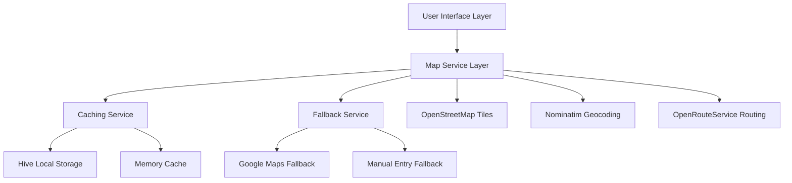
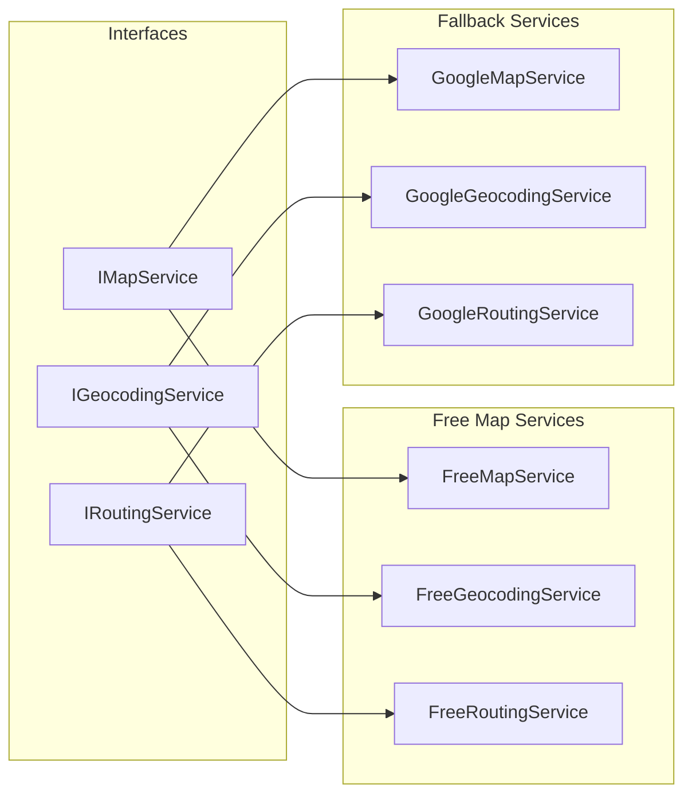

# Design Document

## Overview

This design document outlines the architecture for implementing free map alternatives in the RideLink application. The solution uses OpenStreetMap for map tiles, Nominatim for geocoding, and OpenRouteService for routing, with a robust fallback system and caching layer to ensure reliability and performance.

## Architecture

### High-Level Architecture



### Service Layer Architecture



## Components and Interfaces

### 1. Free Map Service Interface

```dart
abstract class IFreeMapService {
  Future<List<MapTile>> getMapTiles(BoundingBox bounds, int zoom);
  Future<List<PlaceSearchResult>> searchPlaces(String query, {LatLng? location});
  Future<PlaceDetails?> reverseGeocode(LatLng coordinates);
  Future<RouteInfo> calculateRoute(LatLng origin, LatLng destination);
  Future<bool> isServiceAvailable();
}
```

### 2. Caching Service

```dart
abstract class IMapCacheService {
  Future<void> cacheTile(MapTile tile);
  Future<MapTile?> getCachedTile(String tileKey);
  Future<void> cacheGeocodingResult(String query, List<PlaceSearchResult> results);
  Future<List<PlaceSearchResult>?> getCachedGeocodingResult(String query);
  Future<void> cacheRoute(String routeKey, RouteInfo route);
  Future<RouteInfo?> getCachedRoute(String routeKey);
  Future<void> clearExpiredCache();
}
```

### 3. Fallback Service Manager

```dart
abstract class IFallbackManager {
  Future<T> executeWithFallback<T>(
    Future<T> Function() primaryService,
    Future<T> Function() fallbackService,
    String operationType,
  );
  void reportServiceFailure(String serviceName, String operation);
  bool shouldUseFallback(String serviceName);
}
```

### 4. Free Map Widget

```dart
class FreeMapWidget extends StatefulWidget {
  final LatLng? initialLocation;
  final List<MapMarkerData> markers;
  final List<LatLng>? polylinePoints;
  final Function(LatLng)? onLocationSelected;
  final bool showCurrentLocation;
  final bool allowLocationSelection;
  final MapStyle mapStyle;
}
```

## Data Models

### 1. Map Tile Model

```dart
class MapTile {
  final String url;
  final int x;
  final int y;
  final int zoom;
  final Uint8List? imageData;
  final DateTime cachedAt;
  final Duration cacheDuration;
}
```

### 2. Service Configuration

```dart
class FreeMapConfig {
  final String nominatimBaseUrl;
  final String openRouteServiceApiKey;
  final String osmTileServerUrl;
  final Duration requestTimeout;
  final int maxRetries;
  final Duration cacheDuration;
  final bool enableFallback;
}
```

### 3. Service Health Model

```dart
class ServiceHealth {
  final String serviceName;
  final bool isAvailable;
  final Duration averageResponseTime;
  final int failureCount;
  final DateTime lastFailure;
  final double successRate;
}
```

## Implementation Details

### 1. OpenStreetMap Integration

**Tile Loading Strategy:**
- Use standard OSM tile server: `https://tile.openstreetmap.org/{z}/{x}/{y}.png`
- Implement tile caching with LRU eviction
- Respect OSM usage policy (max 2 requests/second)
- Add User-Agent header with app identification

**Flutter Map Integration:**
```dart
TileLayer(
  urlTemplate: 'https://tile.openstreetmap.org/{z}/{x}/{y}.png',
  userAgentPackageName: 'com.ridelink.app',
  maxZoom: 18,
  tileProvider: CachedTileProvider(),
)
```

### 2. Nominatim Geocoding

**Search Implementation:**
- Base URL: `https://nominatim.openstreetmap.org/search`
- Format: JSON
- Rate limit: 1 request/second
- Include country code for better results
- Implement request queuing for rate limiting

**Reverse Geocoding:**
- Base URL: `https://nominatim.openstreetmap.org/reverse`
- Include address details in response
- Cache results for 24 hours
- Fallback to coordinate display if service fails

### 3. OpenRouteService Routing

**API Integration:**
- Requires free API key (2000 requests/day)
- Base URL: `https://api.openrouteservice.org/v2/directions`
- Support for driving-car profile
- Include geometry for polyline display
- Calculate estimated fare based on distance/time

### 4. Caching Strategy

**Multi-Level Caching:**
1. **Memory Cache**: Recently accessed data (LRU, 50MB limit)
2. **Disk Cache**: Map tiles and geocoding results (Hive storage)
3. **Network Cache**: HTTP cache headers for API responses

**Cache Keys:**
- Map tiles: `tile_{z}_{x}_{y}`
- Geocoding: `geocode_{query_hash}_{location_hash}`
- Routes: `route_{origin_hash}_{destination_hash}`

### 5. Fallback System

**Fallback Hierarchy:**
1. **Primary**: Free services (OSM, Nominatim, OpenRouteService)
2. **Secondary**: Alternative free services (MapBox free tier)
3. **Tertiary**: Google Maps (for critical operations only)
4. **Final**: Manual coordinate entry with basic map display

**Failure Detection:**
- Timeout after 10 seconds
- HTTP error codes (4xx, 5xx)
- Rate limit exceeded (429)
- Service unavailable (503)

## Error Handling

### 1. Network Errors
- Retry with exponential backoff (1s, 2s, 4s)
- Switch to cached data if available
- Show user-friendly error messages
- Log errors for monitoring

### 2. Rate Limiting
- Implement request queuing
- Show loading indicators for delayed requests
- Switch to fallback services when limits exceeded
- Reset counters at appropriate intervals

### 3. Service Unavailability
- Health check endpoints for service monitoring
- Automatic fallback to alternative services
- Graceful degradation of features
- User notification of limited functionality

## Testing Strategy

### 1. Unit Tests
- Service layer functionality
- Caching mechanisms
- Fallback logic
- Error handling scenarios

### 2. Integration Tests
- API connectivity and responses
- Cache persistence and retrieval
- Fallback service switching
- End-to-end location workflows

### 3. Performance Tests
- Map tile loading times
- Geocoding response times
- Memory usage monitoring
- Cache hit/miss ratios

### 4. Offline Tests
- Cached tile display
- Offline functionality
- Network reconnection handling
- Data synchronization

## Performance Considerations

### 1. Map Rendering
- Lazy loading of map tiles
- Tile prefetching for smooth panning
- Memory management for large tile caches
- Efficient marker clustering for multiple locations

### 2. API Optimization
- Request batching where possible
- Debounced search queries
- Intelligent cache invalidation
- Connection pooling for HTTP requests

### 3. Battery Optimization
- Reduce location updates when app is backgrounded
- Efficient tile loading algorithms
- Minimize network requests through caching
- Use appropriate location accuracy settings

## Security Considerations

### 1. API Key Management
- Store OpenRouteService API key securely
- Implement key rotation capability
- Monitor API key usage
- Restrict API key permissions

### 2. Data Privacy
- Minimize location data storage
- Implement data retention policies
- Secure transmission of location data
- User consent for location tracking

### 3. Service Abuse Prevention
- Implement rate limiting on client side
- Monitor unusual usage patterns
- Validate all user inputs
- Prevent automated abuse of services

## Monitoring and Analytics

### 1. Service Metrics
- API response times and success rates
- Cache hit/miss ratios
- Fallback service usage
- Error rates by service type

### 2. User Experience Metrics
- Map load times
- Search result relevance
- Route calculation accuracy
- User interaction patterns

### 3. Cost Monitoring
- API usage tracking
- Bandwidth consumption
- Storage usage for caches
- Fallback service costs

This design provides a robust, scalable solution for implementing free map alternatives while maintaining good user experience and system reliability.