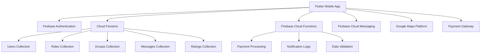

# Design Document

## Overview

RideLink is a Flutter-based mobile application that facilitates collaborative cab-sharing through a group-based system. The architecture follows a clean, scalable approach using Firebase as the backend-as-a-service platform, implementing real-time features, secure authentication, and integrated payments.

The application uses a leader-member model where group leaders create rides and manage participants, while members can discover, join, and participate in shared transportation experiences. The design emphasizes user safety, cost efficiency, and community trust through ratings and verification systems.

## Architecture

### High-Level Architecture



### Client-Side Architecture (Flutter)

The Flutter application follows a layered architecture pattern:

- **Presentation Layer**: UI widgets and screens using Provider/Riverpod for state management
- **Business Logic Layer**: Services and repositories handling business rules
- **Data Layer**: Firebase SDK integration and local caching with Hive/SharedPreferences
- **External Services Layer**: Google Maps, Payment gateway, and push notifications

### Backend Architecture (Firebase)

- **Authentication**: Firebase Auth with Google Sign-In provider
- **Database**: Cloud Firestore with real-time listeners for live updates
- **Functions**: Cloud Functions for server-side logic and payment processing
- **Storage**: Firebase Storage for profile images and ride-related media
- **Messaging**: FCM for push notifications and real-time communication

## Components and Interfaces

### Core Components

#### 1. Authentication Service
```dart
abstract class AuthService {
  Future<User?> signInWithGoogle();
  Future<void> signOut();
  Stream<User?> get authStateChanges;
  User? get currentUser;
}
```

#### 2. User Management Service
```dart
abstract class UserService {
  Future<UserProfile> createProfile(UserProfile profile);
  Future<UserProfile> updateProfile(UserProfile profile);
  Future<UserProfile?> getUserProfile(String userId);
  Future<double> getUserRating(String userId);
}
```

#### 3. Ride Management Service
```dart
abstract class RideService {
  Future<String> createRide(RideDetails ride);
  Future<List<RideGroup>> searchRides(SearchCriteria criteria);
  Future<void> requestToJoin(String rideId, String userId);
  Future<void> approveJoinRequest(String rideId, String requesterId);
  Future<void> startRide(String rideId);
  Future<void> completeRide(String rideId);
}
```

#### 4. Chat Service
```dart
abstract class ChatService {
  Stream<List<Message>> getGroupMessages(String groupId);
  Future<void> sendMessage(String groupId, Message message);
  Future<void> markMessagesAsRead(String groupId, String userId);
}
```

#### 5. Location Service
```dart
abstract class LocationService {
  Future<Position> getCurrentLocation();
  Stream<Position> getLocationStream();
  Future<List<Placemark>> getAddressFromCoordinates(double lat, double lng);
  Future<DirectionsResult> getDirections(LatLng origin, LatLng destination);
}
```

#### 6. Payment Service
```dart
abstract class PaymentService {
  Future<PaymentIntent> createPaymentIntent(double amount);
  Future<bool> processPayment(String paymentIntentId);
  Future<void> transferToLeader(String leaderId, double amount);
}
```

### UI Components

#### Screen Structure
- **AuthScreen**: Google Sign-In interface
- **HomeScreen**: Map view with nearby rides and search functionality
- **CreateRideScreen**: Form for ride creation with map integration
- **RideDetailsScreen**: Detailed view of ride information and join functionality
- **MyRidesScreen**: Tabbed view for upcoming and completed rides
- **GroupChatScreen**: Real-time messaging interface
- **ProfileScreen**: User profile management and settings

#### Reusable Widgets
- **RideCard**: Display ride information in lists
- **UserAvatar**: Profile picture with rating display
- **MapWidget**: Google Maps integration with custom markers
- **PaymentWidget**: Payment form and status display
- **RatingWidget**: Star rating input and display

## Data Models

### User Profile
```dart
class UserProfile {
  final String id;
  final String name;
  final String email;
  final String? profileImageUrl;
  final String? bio;
  final String? phoneNumber;
  final double averageRating;
  final int totalRides;
  final bool isVerified;
  final DateTime createdAt;
  final DateTime updatedAt;
}
```

### Ride Group
```dart
class RideGroup {
  final String id;
  final String leaderId;
  final String pickupLocation;
  final LatLng pickupCoordinates;
  final String destination;
  final LatLng destinationCoordinates;
  final DateTime scheduledTime;
  final int totalSeats;
  final int availableSeats;
  final double totalFare;
  final double pricePerPerson;
  final String? notes;
  final bool femaleOnly;
  final RideStatus status;
  final List<String> memberIds;
  final List<JoinRequest> joinRequests;
  final DateTime createdAt;
}
```

### Message
```dart
class Message {
  final String id;
  final String groupId;
  final String senderId;
  final String content;
  final MessageType type;
  final DateTime timestamp;
  final List<String> readBy;
}
```

### Rating
```dart
class Rating {
  final String id;
  final String rideId;
  final String raterId;
  final String ratedUserId;
  final int stars;
  final String? comment;
  final DateTime createdAt;
}
```

### Firestore Collections Structure

```
users/{userId}
  - profile data
  - settings
  
rides/{rideId}
  - ride details
  - member list
  - status
  
groups/{groupId}/messages/{messageId}
  - chat messages
  - subcollection for scalability
  
ratings/{ratingId}
  - user ratings
  - ride references
  
joinRequests/{requestId}
  - pending join requests
  - approval status
```

## Error Handling

### Error Categories

1. **Network Errors**: Connection timeouts, offline scenarios
2. **Authentication Errors**: Sign-in failures, token expiration
3. **Validation Errors**: Invalid input data, business rule violations
4. **Payment Errors**: Transaction failures, insufficient funds
5. **Location Errors**: GPS unavailable, permission denied
6. **Firebase Errors**: Firestore limits, function timeouts

### Error Handling Strategy

```dart
class AppError {
  final ErrorType type;
  final String message;
  final String? code;
  final dynamic originalError;
  
  // Factory constructors for different error types
  factory AppError.network(String message) => AppError._(ErrorType.network, message);
  factory AppError.auth(String message, String code) => AppError._(ErrorType.auth, message, code);
  factory AppError.validation(String message) => AppError._(ErrorType.validation, message);
}
```

### Global Error Handler
- Centralized error logging with Firebase Crashlytics
- User-friendly error messages with retry options
- Offline capability with local data caching
- Graceful degradation for non-critical features

## Testing Strategy

### Unit Testing
- Service layer testing with mocked dependencies
- Business logic validation
- Data model serialization/deserialization
- Utility function testing

### Integration Testing
- Firebase service integration
- Payment gateway integration
- Google Maps API integration
- End-to-end user flows

### Widget Testing
- UI component behavior
- State management testing
- Navigation flow testing
- Form validation testing

### Test Structure
```
test/
├── unit/
│   ├── services/
│   ├── models/
│   └── utils/
├── integration/
│   ├── firebase/
│   ├── payments/
│   └── maps/
└── widget/
    ├── screens/
    ├── components/
    └── forms/
```

### Testing Tools
- **flutter_test**: Core testing framework
- **mockito**: Mocking dependencies
- **firebase_auth_mocks**: Firebase Auth testing
- **fake_cloud_firestore**: Firestore testing
- **integration_test**: End-to-end testing

### Performance Testing
- Load testing for concurrent users
- Real-time messaging performance
- Map rendering optimization
- Battery usage optimization
- Memory leak detection

### Security Testing
- Authentication flow security
- Data validation testing
- Payment security verification
- Location data privacy
- Firebase security rules testing

The design ensures scalability, maintainability, and user experience while addressing all requirements specified in the requirements document. The modular architecture allows for independent development and testing of features while maintaining system cohesion.